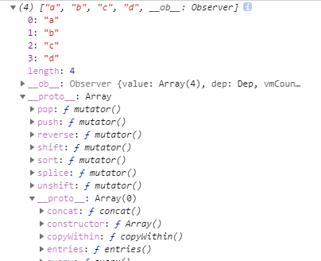

# Vue 数据响应式的理解

Vue 数据响应式，通俗的讲，当 data (数据)发生变化，页面视图也会跟着改变。

比如：
```js
new Vue({
    data:{
        n:0
    },
    template:`
        <div>
            {{n}}
            <button @cilck="add">+1</button>
        </div>
    `,
    methods:{
        add(){
            this.n ++;
        }
    }
}).$mount("#app")
```
当点击 button 按钮，数据 n 会改变，页面也会随之改变。

但是，如果出现特殊情况，比如：

1. 第一种情况

    ```js
    new Vue({
        data:{},
        template:`<div>{{n}}</div>`
    }).$mount("#app")
    ```
    vue 会提示错误
    ```js
    [Vue warn]: Property or method "n" is not defined on the instance but referenced during render. Make sure that this property is reactive, either in the data option, or for class-based components, by initializing the property.
    ```
2. 第二种情况

    ```js
    new Vue({
        data: {
            obj: {
                a: 0 
            }
        },
        template: `
            <div>
            {{obj.b}}
            <button @click="setB">set b</button>
            </div>
        `,
        methods: {
            setB() {
                this.obj.b = 1; 
            }
        }
    }).$mount("#app");
    ```
    当我们点击 setB 按钮，页面并不会显示 1 。因为 Vue 没有监听不存在的 obj.b 

**解决方法：**
    
1. 我们可以直接声明一个空的 key 。

    ```js
    //只展示data部分
    data : {
        a : 0,
        b : undefined
    }
    ```
    当点击按钮 setB ，页面显示 1

2. 使用 `this.$set` 或者 `Vue.set`

    ```js
    //只展示 methods 部分
    methods:{
        setB(){
            this.$set(this.obj,'b',1)
            //Vue.set(this.obj,'b',1)
        }
    }
    ```
但是，如果 data 里面有数组，又该怎么办？我们可以用上面的第二种方法解决问题。

```js
new Vue({
  data: {
    array: ["a", "b", "c"]
  },
  template: `
    <div>
      {{array}}
      <button @click="setD">set d</button>
    </div>
  `,
  methods: {
    setD() {
      this.$set(this.array,[3],"d") 
    }
  }
}).$mount("#app");
```
但是，我们不可能每次添加元素都要 `this.$set` 。于是，尤雨溪篡改了数组的 7 个 API ，调用后会更新 UI。
```js
//methods 部分

methods:{
    setD(){
        this.array.push("d")
        console.log(this.array);
    }
}

```
从开发者工具看到，修改的 7 个 API。




